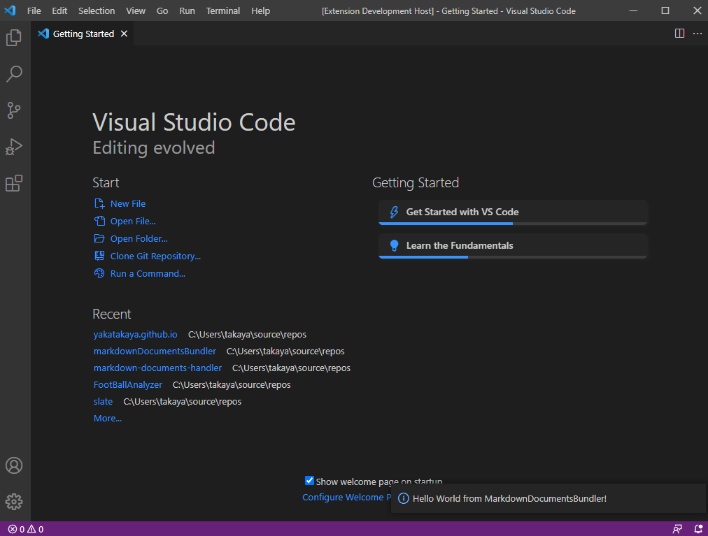
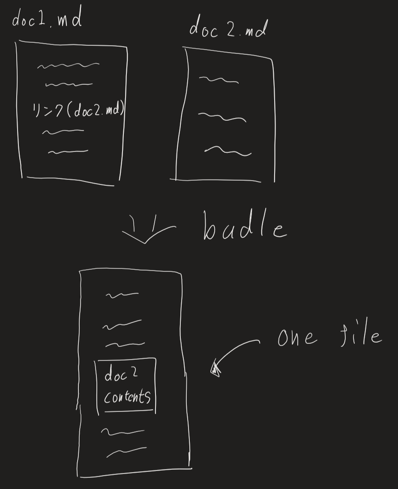

とりあえず以下の公式ドキュメントを読んで進める。（英語でも最近なるべく公式ドキュメントを読むようにしようとしている）

[https://code.visualstudio.com/api/get-started/your-first-extension](https://code.visualstudio.com/api/get-started/your-first-extension)

## プロジェクト作成まで

1. Node.jsをインストール
2. 普通にインストールすればnpmが使えるようになるはずなのでVSCodeのターミナルで`npm`と打ったら反応してくれることを確認
3. 後は`npm install -g yo generator-code`を実行してよくわからない`yo`っていう機能と`generator-code`というプラグインをコンパイルするソフトをインストール
4. ターミナルで`yo code`を実行
5. そうすると色々プラグイン名だとかプラグインの詳細とか色々対話形式で質問されるので答える(identifierにはアルファベットの大文字は使えない？)

## 実行まで

1. なんとプロジェクトのフォルダに移動して、F5だけでビルド始まる（超簡単）
2. 初期状態では`Hello World`のコマンドが追加されているからそれをコマンドパレットで実行して画面右下にメッセージが表示されたら成功

## API調べる

以下にAPI一覧がある。やりたいことに対して必要そうなAPIを調査していく

https://code.visualstudio.com/api/references/vscode-api

### 実装したい機能

