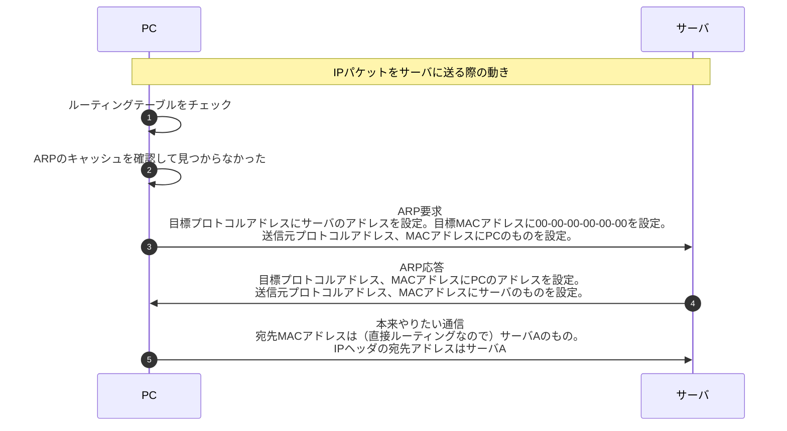

とにかくわからない単語をひたすらリストアップしていく（このページを覚えていればこの問題に全問こたえられるくらいにする）

## ARPスプーフィング

- 参考書にのってねえ
- ググるとARPキャッシュポイズニングともいうらしい（こっちのほうがイメージしやすいな）
- ブロードキャストされるARPリクエストに不正な応答をしてリクエスト送信元のキャッシュのなかでIPアドレスとMACアドレスを結びつけてしまう
- そのIPアドレスを宛先とする通信を盗み見たりできてしまう

## DHCPリレーエージェント

- クライアントがサーバからTCP/IP設定情報を取得するときにブロードキャストパケットが別ドメイン届かない問題を解消する
- ルータの機能として実装される
- ルータはブロードキャストパケットを受け取るとその中のDHCPメッセージを取り出し、ユニキャストパケットを用いてDHCPサーバに転送する
- ユニキャストなので転送先はあらかじめ設定しなければならない
- 応答も同じくユニキャストパケット
- クライアントからはDHCPリレーエージェントを経由したと意識することなく同一ブロードキャストドメインに存在しているかのように見える
- リレーエージェント情報オプションという情報をDHCPパケットに付加できる（リレーエージェントのMACアドレスとパケットを受信したポート番号など）

## DHCPスヌーピング

- SWが持つ機能
- 正規のDHCPサーバからIPアドレスを割り当てられたPCだけ通信を許可する
- スヌーピングは監視の意味
- SWのポートはUntrustedポートと、Trustedポートの2種類となる
- Trustedポートに接続した機器は通信が可能となる
- Untrustedポートに接続していても、正規のDHCPサーバからIPアドレスが割り当たられていれば通信が可能となる

## ARPパケット
  

