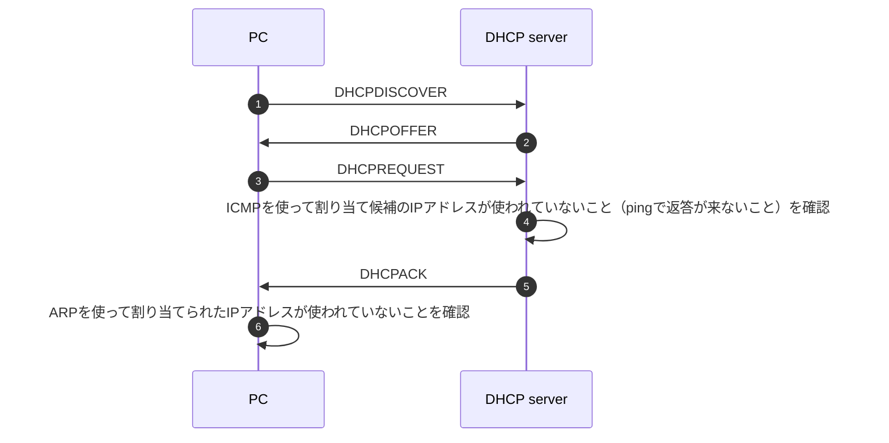
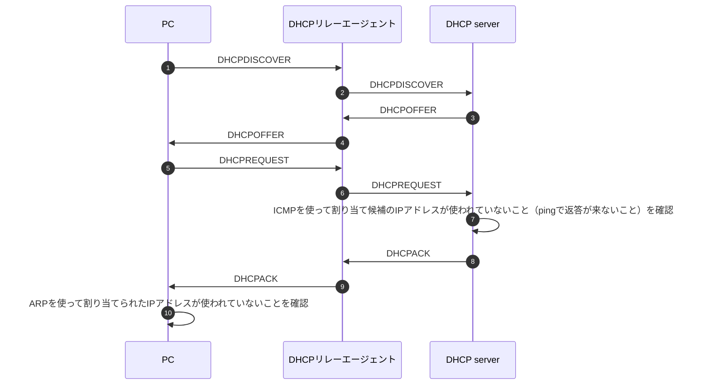

# DHCPとは

Dynamic Host Configuration Protocol
動的にIPアドレスを割り当ててくれる。

# 通信の流れ

- 4回のメッセージのやり取りでIPアドレスが割り当てられる
- PCからのメッセージは基本的にはブロードキャストで行われるみたい（DHCPサーバーがどこにいるかわからないから）

# DHCPリレーエージェント

- 大規模なネットワークを構築する場合は各サブネットごとにDHCPサーバをせっちするのは大変
- DHCPパケットを中継するような役割

